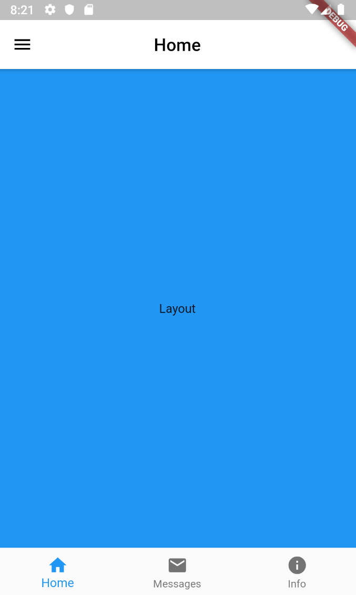
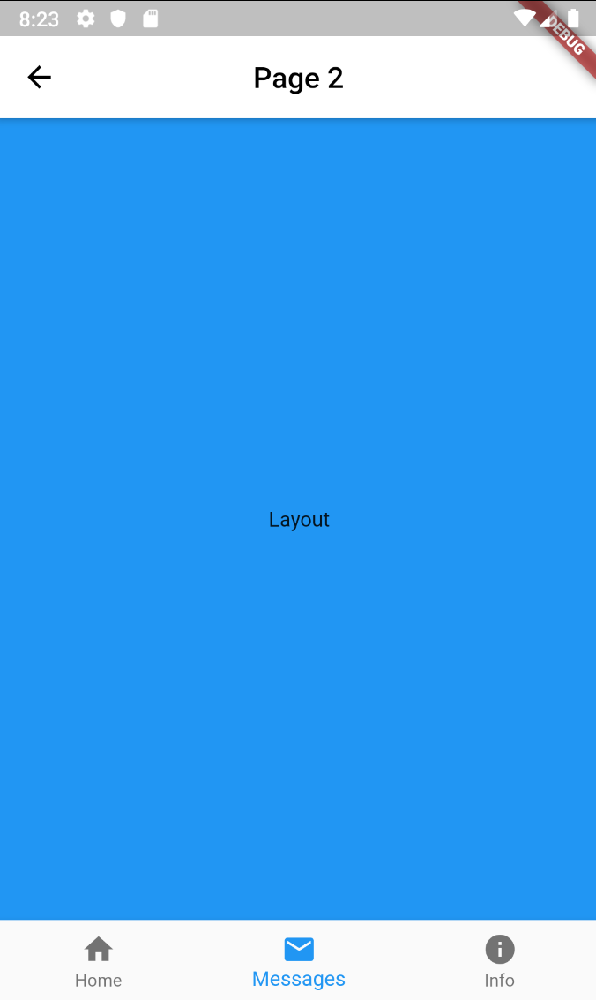

# using_polymorphism_flutter

A flutter application that focus specifically on design patterns using polymorphism and inheritance. The purpose of the application is to show to usage of polymorphism between three different pages with similar designs but includes different contents. 

## Features
- Abstract classes
- Mixins

## Getting Started

This project is a starting point for a Flutter application.

A few resources to get you started if this is your first Flutter project:

- [Lab: Write your first Flutter app](https://flutter.dev/docs/get-started/codelab)
- [Cookbook: Useful Flutter samples](https://flutter.dev/docs/cookbook)

For help getting started with Flutter, view our
[online documentation](https://flutter.dev/docs), which offers tutorials,
samples, guidance on mobile development, and a full API reference.

### Installing

What things you need to install the software and how to install them

Install the Flutter sdk with [Windows](https://flutter.dev/docs/get-started/install/windows), [MacOS](https://flutter.dev/docs/get-started/install/macos), or [Linux](https://flutter.dev/docs/get-started/install/linux)

### Prerequisites

A step by step series of examples that tell you how to get a development env running

1. git clone https://github.com/forgreatness/demo1_app.git
2. Run "flutter pub get" within the root of project
3. Set up emmulator or a physical devices for testing
4. Run "flutter doctor" for sdk diagnoses
5. Run "flutter run" for testing development env

## Pages

  
   
  

## Authors

* **Danh Nguyen** - *Initial work* - [forgreatness](https://github.com/forgreatness)

## License
